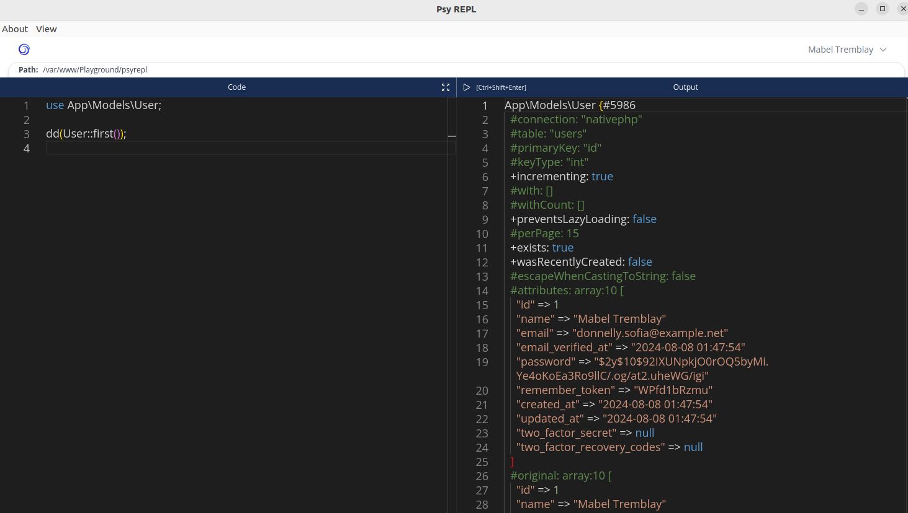

# Psy REPL

A Simple REPL for Laravel projects.

Built on top of [Native PHP](https://nativephp.com).

## How to set it up

This is a Native PHP project. In other words, it is a desktop app built with PHP. To run it, you don't need to have PHP installed on your machine, but to develop with it, you do. But, for the app to accomplish its goals, because it is a REPL, you need PHP to be available in the environment where you are running it: if docker, to be available in docker, if bare metal, in the host machine.

### Running it

To run it in the development environment, just clone it, run `composer install` and `php artisan native:serve` in the terminal.

### Building it

You can build it with `php artisan native:build`. This will create the installable assets in the `./dist` directory.
