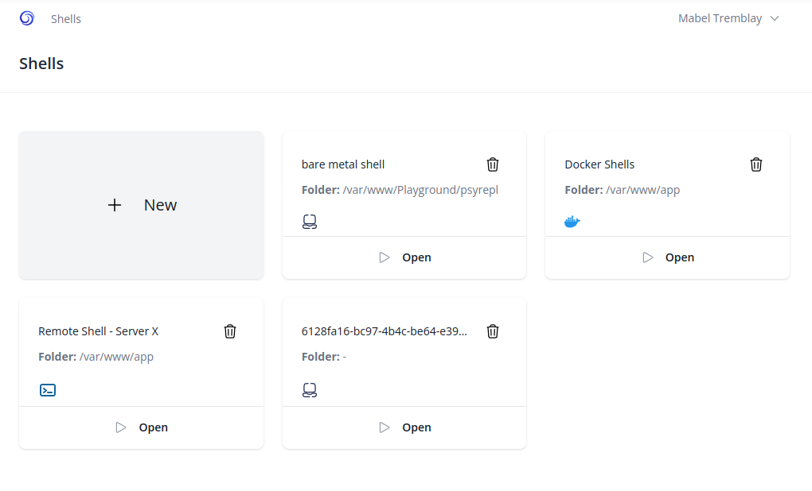
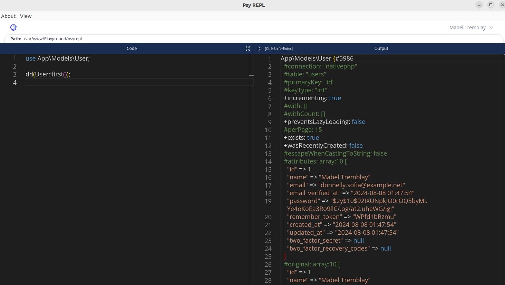

# Psy REPL

A Simple and Powerful REPL for Laravel Projects

Psy REPL is an interactive shell for Laravel projects, designed to enhance your development experience. Built on top of [Native PHP](https://nativephp.com), it offers a seamless interface for testing and debugging your Laravel code in real time.

## Key Features

Native PHP Desktop App: A desktop application built with PHP, no need for PHP installation on your machine to run the app.

Interactive Shell: Execute Laravel commands, run code snippets, and test your applications within a dedicated REPL environment.

Cross-Platform Support: Runs effortlessly on any platform, whether you're using Docker or a bare-metal host environment.

## Screenshots

Dashboard screen:



REPL screen:



## Installation

At this moment it can be built for all platforms, but it is only tested with Linux and Windows. Just download form releases and install it.

## Setup Instructions for Building and Running the Application

### Prerequisites

While you don't need PHP installed on your machine to run the Psy REPL, you do need PHP available in your environment if you wish to develop or use it as a REPL:

- **Docker Users:** Ensure PHP is available within your Docker environment.
- **Bare Metal Users:** Ensure PHP is installed on your host machine.

### Development Setup

To get started with development:

1. Clone the repository:
   ```bash
   git clone https://github.com/Jacked-PHP/psy-repl.git
   ```
2. Create the `.env`:
   ```bash
   cp .env.example .env
   ```
3. Generate key:
   ```bash
   php artisan key:generate
   ```
4. Install dependencies:
   ```bash
   composer install
   npm install
   ```
5. Serve the application:
   ```bash
   php artisan native:serve
   ```

### Building the Application

To build the application for distribution:

#### Linux x64
1. Run the build command
    ```bash
    rm -rf vendor node_modules
    composer install
    npm ci
    npm run build
    php artisan native:build linux x64
    ```
2. Find the installable assets in the `./dist` directory.

#### Windows

1. Make sure you followed the development setup;
   ```bash
   cp .env.example .env
   composer install
   npm install
   php artisan key:generate
   ```
2. Migrate the database;
   ```bash
   php artisan migrate
   ```
3. Run below command and follow the prompts to build the application (You may need to run this command in a terminal that has administrator privilages);
   ```bash
   php artisan native:build
   ```
4. Find the installable assets in the `./dist` directory.

**Troubleshooting**

If you get an error saying `The process "composer install --no-dev" exceeded the timeout of 60 seconds.`, run the `php artisan native:build` command again.

If you still cannot build the application with administrator privilages, go to the `Task manager` and find if `Electron` is still running and, if it is running end it.

## How to set it up

This is a Native PHP project. In other words, it is a desktop app built with PHP. To run it, you don't need to have PHP installed on your machine, but to develop with it, you do. But, for the app to accomplish its goals, because it is a REPL, you need PHP to be available in the environment where you are running it: if docker, to be available in docker, if bare metal, in the host machine.

## Contribution

We welcome contributions to Psy REPL! Whether you want to report bugs, suggest new features, or contribute code, we appreciate your involvement.

